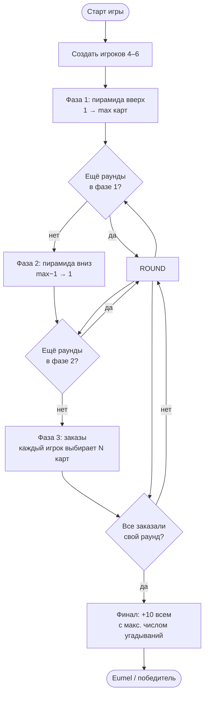
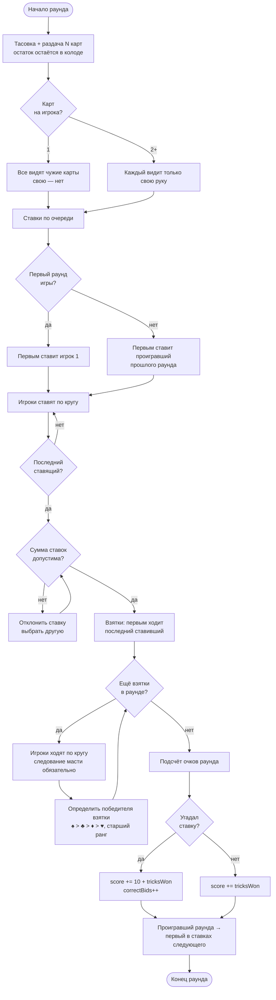
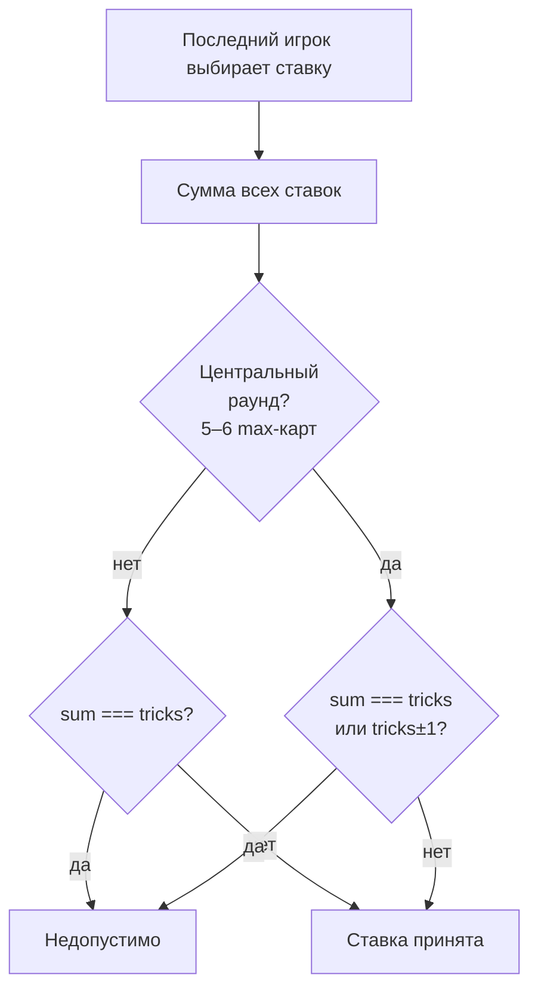
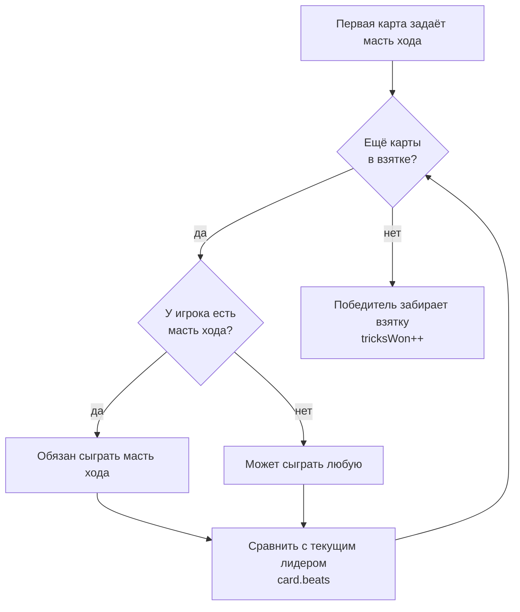
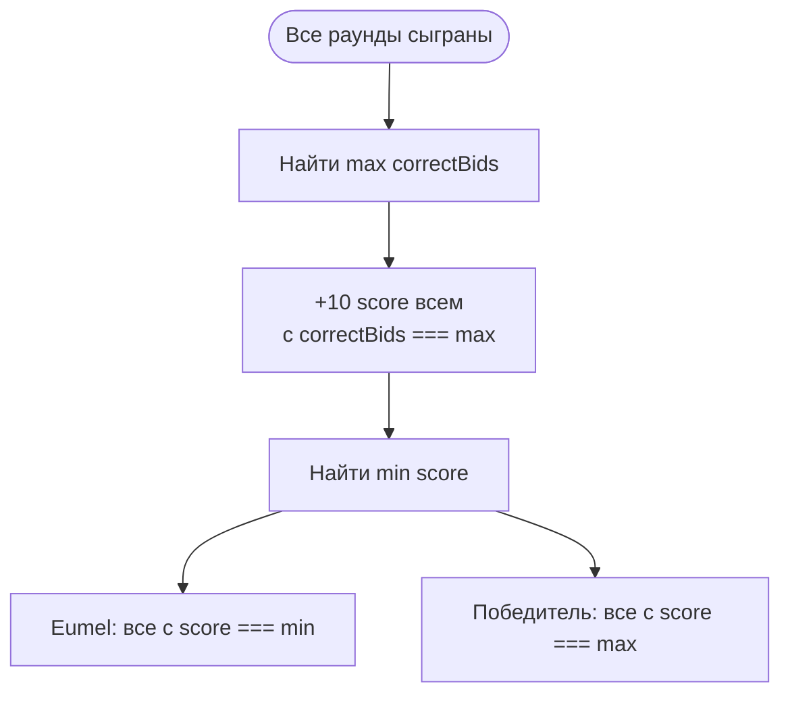

# Eumel — Flowchart

> **Графическая версия:** открой [`flowchart.html`](./flowchart.html) в браузере  
> или выполни `npm run docs`

## Общий поток игры

---

## Один раунд

---

## Проверка суммы ставок (последний ставящий)

---

## Подсчёт взятки

---

## Финал игры

